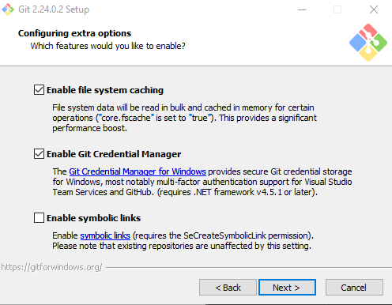
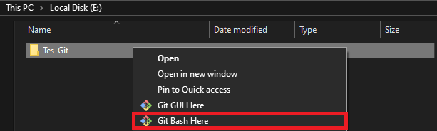

# Latihan
## Cara Install Git

### 1. Download File Git
Untuk menginstal Git, Anda perlu mendownload file-nya terlebih dahulu disitus resminya.
Download sesuai tipe sistem operasi pada komputer Anda.

### 2. Instal Git
Setelah mengunduh file Git, buka setup aplikasi Git untuk memulai proses instalasi.
Halaman awal setelah anda membuka setup aplikasi Git adalah tampilan Document License 
dari Git. Klik Next untuk melanjutkan instalasi.

### 3. Tentukan Lokasi Instalasi Git
Selanjutnya, pilih lokasi untuk install Git Pada komputer Anda. Pada tutorial ini Saya
menginstal di lokasi C:\Program Files\Git. Setelah menentukan lokasi instalasi Git,
klik Next untuk melanjutkan.

### 4. Pilih Komponen Tambahan
Kemudian pilih komponen tambahan untuk install git. Fungsi komponen untuk memperlancar
penggunaan Git dan mendukung file dengan kapasitas besar. Sesuaikan komponen yang dipilih
pada gambar di bawah ini. Jika sudah klik Next untuk lanjut.

### 5. Tentukan Nama Aplikasi Git
sebenarnya Anda bebas mengganti nama aplikasi Git yang akan tampil pada Start Menu.
Saya menyarankan gunakan nama Git saja agar mudah saat nencarinya. Oke Next lagi.

### 6. Tentukan File Editor
Untuk mengedit script melalui Git, Anda memerlukan file editor. Anda bebas menggunakan 
file editor apa pun untuk dikombinasikan dengan Git. Klik Next apabila sudah menentukan
file editor yang akan digunakan.

### 7. Atur Patch Environment
Selanjutnya adalah pengaturan Patch Evirontment. Patch Evirontment berfungsi untuk
mengeksekusi perintah pada Git. Pilih - Git from the command line and also from 3rd
party software - agar saat menjalankan perintah dapat dikenali di Comman Prompt (CMD)
pada windows.

### 8. Pilih Aplikasi SSH
Pada tutorial ini Saya menggunakan -Use OpenSSH, aplikasi default SSH dari Gt.
Klik Next untuk melanjutkan.

### 9. Pilih Line Ending
Pada tutorial ini Saya memilih -Checkout Windows-style, commit Unix-style line endings-.
Klik Next untuk lanjut.

### 10. Pilih Emulator Terminal
Anda bisa menggunakan Command Prompt atau MinTTY, karena ingin menggunakan Command Prompt,
Pada tutorial ini saya memilih -Use Windows' default console windows. Klik Next untuk
melanjutkan instalasi.

### 11. Tentukan Opsi Ekstra
Pertama, pilih -Enable File System Caching- agar Git memiliki fungsi system caching.
Kedua, pilih -Enable Git Credential Manager- agar Git bisa dikombinasikan 
dengan aplikasi lain seperti Visual Studio, dan Github. Klik Next untuk Lanjut.

### 12. Mulai Proses Instalasi
Setelah menambahkan konfigurasi pada Git, Anda bisa memulai proses instalasi. 
Klik Install untuk melanjutkan proses

Berikut adalah tampilan instalasi Git.
Tunggu hingga proses instalasi selesai.

### Selesai

## Cara Penggunaan Git
Setelah selesai instal, selanjutnya Saya akan memberikan 11 cara menggunakan Git.
Berikut ini adalah Langkah-langkahnya :

### 1. Login Git
Untuk login anda bisa menggunakan akun Github, Gitlab, atau Bitbucket.
Anda bisa login awal Git menggunakan Command Prompt. Kemudian masukan
perintah-perintah yang akan kami jelaskan dibawah ini.

Selanjutnya, masukan username GitHub anda menggunakan perintah dibawah ini.
Lalu tekan ENTER jika sudah.

$ git config --global user.name "UsernameAnda"

Kemudian masukan email yang terdafar di GitHub anda menggunakan perintah 
dibawah ini. Tekan ENTER jika sudah.

$ git config --global user.email isidenganemailanda@gmail.com

Selanjutnya untuk memastikan proses login berhasil, masukan perintah berikut.

$ git config --list

### 2. Login GitHub
GitHub dan Git memiliki hubungan khusus, yaitu Git sebagai version control system
dan Github menjadi hosting atau menyimpan kode program.

Setelah anda login akan muncul dashboard dari GitHub seperti ini :

### 3. Buat Repository
Setelah berhasil login ke GitHub, Klik tombol New pada menu Repositories
untuk membuat repository baru.

Kemudian anda diarahkan ke halaman untuk membuat repository.
Anda Perlu mengisi detail informasi berikut.

- Nama Repository : digunakan untuk identitas repository yang dibuat.
- Deskripsi Repository : untuk deskripsi dari repository yang dibuat.
- Jenis Repository : ada Privat dan Publik, siapa saja yg dapat melihatnya.
 
 Setelah mengisi detail informasi diatas, klik Create Repository.

 ### 4. Buka Folder Pada Windows
 Selanjutnya, Anda perlu membuat folder pada local disk komputer anda. 
 Untuk menyimpan update file repository GitHub yang dibuat.
 

### 5. Buka Folder Menggunakan Git Bash

Setelah berhasil membuat folder pada local disk komputer Anda, buka folder tersebut
dengan cara klik kanan  lalu pilih Git Bash Here.

### 6. Ubah Folder Mnenjadi Repository
Setelah itu, ubah folder tersebut menjadi repository menggunakan perintah berikut :

$ git init

### 7. Tambahkan File Ke Repository 
Untuk bisa menambahkan file ke repository GitHub, Anda perlu menerapkan 
langkah-langkah dibawah ini :

- Buat file di folder yang sudah dibuat (Test Git). Contohnya, disini 
  kami membuat file index.php
- Buka Git Bash lalu masukan perintah berikut.

  $ git add index.php

  Perintah tersebut akan menghasilkan output apapun.

### 8. Buat Commit 
Selanjutnya, Anda perlu membuat commit. Commit berfungsi untuk menambahkan 
update file serta komentar. Jadi setiap kontributor bisa memberikan konfirmasi update file 
di proyek yang sedang dikerjakan. Masukan perintah berikut ini 
untuk membuat commit:

$ git commit -m "first commit"

Pada tutorial ini kami membuat first commit sebagai commit pertama kami. Anda bebas
membuat nama commit apa saja.

### 9. Remote Repository GitHub
Remot repository berfungsi untuk mengupload file yang telah anda buat sebelumnya 
di local disk. Masukan perintah berikut ini untuk melakukan remote repository.

$ git remote add origin git@github.com:UsernameGit/NamaRepository.git

Perintah diatas tidak akan menghasilkan output apapun.

### 10. Push Ke GitHub
Langkah terakhir adalah push ke GitHub berfungsi untuk mengupload hasil akhir dari langkah-langkah 
diatas. Masukan perintah berikut ini untuk Melakukan Push ke GItHub:

$ git push -u origin main

perintah diatas tidak akan menampilkan pop up sign GitHub. Anda perlu login untuk 
melanjutkan proses push ke GitHub.

Jika proses login berhasil, akan muncul tampilan
comman prompt seperti dibawah ini:

### 11. Cek File 
Setelah itu, cek repository yang telah anda buat.
anda akan mendapatkan file file yang telah anda tambahkan sebelumnya.

## KESIMPULAN
 Cara menggunakan Git ini wajib diketahui dan dikuasai oleh semua
 developer karena akan sangat membantu dalam mengerjakan project pembuatan website. 
 Demikian penjelasan tentang cara menggunakan Git.

